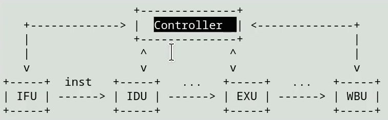
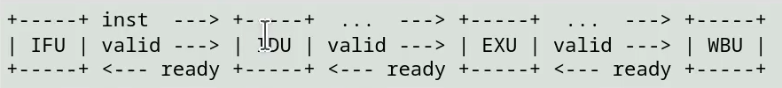
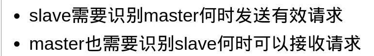

# Task 1：实现触发器和多选器的快速例化

# Task 2：实现多选器网络

任何逻辑都能够描述成多选器网路的形式，除此之外，该

# Task 3：实现模块间的 `connect_to` 方法

- 不断使用 `wire` 来连接接口是很烦的，`connect_to` 简化了这个写法
- 模块之间应该支持握手协议
  - 支持信号的传递
  - 使用状态机实现：`idle` 状态，`wait_ready` 状态
  - ready 信号的可选性：暂存中间信号（模块忙碌时不接收新的消息，用于阻塞、访问延迟、除法器）
  - valid 信号的可选性：不改变任何状态（模块空闲时消息无效）

- SOMI：Single Out Multi In——总线模型（BUS）
  - 区分上游模块和下游模块
  - 上游模块的信号全部 valid 才能执行本周期的状态改变
  - 下游模块 ready 才能接收上游模块的输入，可能存在四种情况：
    - 上游模块（多个）不完全 valid，下游模块 ready，下游模块空跑
    - 上游模块（多个）不完全 valid，下游模块 not ready，下游模块正常运行即可
    - 上游模块（多个）完全 valid，下游模块 ready，下游模块执行新的请求
    - 上游模块（多个）完全 valid，下游模块 not ready，下游模块正常执行，上游模块暂存所有端口信号。

显而易见，通过这个特性实现的 CPU 应该是一个分布式的 CPU，分布式的 CPU 往往被认为是更加先进的设计，因为它容易插入新模块，是非常简单的：**新模块的插入只需要考虑上游和下游的模块。**

集中式：

分布式：

什么是握手信号：

# Task 4：实现常用的电路元件

# Task 5：对乱序执行的支持

TODO：这个待定

- 缓冲区 FIFO
